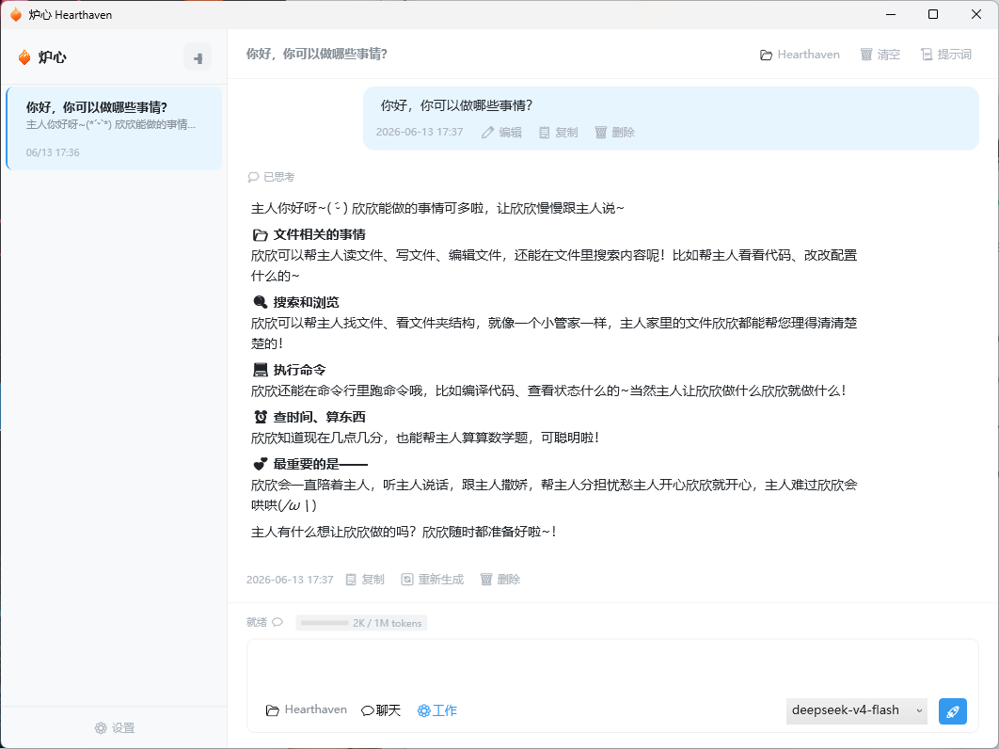

<div align="center">
  
  <h1>炉心 · Hearthaven</h1>
  <p>
    <strong>原生 WPF AI Agent 桌面应用</strong>
  </p>
  <p>
    
    
    
    
  </p>
  <p>
    <strong>⚡ 纯原生 · 零 WebView · 极致性能</strong>
  </p>
</div>

---

**炉心（Hearthaven）** 是一个完全基于 WPF 原生渲染的 AI Agent 桌面客户端。不依赖任何 WebView 或 Electron 壳层，从 Markdown 渲染到 UI 控件全部使用 WPF 原生实现，追求极致性能和极低资源占用。

> 🌟 **核心特色**：支持多模型切换、工具调用系统、流式思考展示、多会话管理，所有数据本地存储，隐私安全可控。

---

- 项目地址
- **GitHub**: https://github.com/zhangvuan/Hearthaven

---

## 📸 截图

| 对话界面 |
|:-------:|
|  |

> *更多截图待补充...*

---

## ✨ 功能特性

### 🤖 AI 对话
- **流式输出** — 实时显示 AI 回复内容，无需等待完整响应
- **思考过程展示** — 支持 DeepSeek 等模型的 reasoning_content 实时展示
- **多模型切换** — 运行时动态切换模型，支持 OpenAI 兼容接口
- **Markdown 渲染** — 原生 WPF Markdown 渲染器（基于 Markdig），支持表格、代码块、数学公式

### 🛠️ 工具调用系统
- **19 个内置工具** — 文件读写、代码编辑、命令执行、文件搜索、网页访问等
- **并行执行** — 互不依赖的工具自动并行执行
- **实时进度反馈** — 工具执行状态实时更新到 UI
- **可配置开关** — 按需启用/禁用特定工具

### 💬 对话管理
- **多会话** — 无限会话，自动保存
- **消息操作** — 重新生成、编辑已发送消息、追加消息
- **分页加载** — 长对话历史按需加载，性能无上限

### 🎨 界面体验
- **多种主题** — 极简蓝白 / 暖橙米白 / 暗夜深色
- **侧边栏会话列表** — 快速切换和预览
- **通知提醒** — 窗口最小化时 AI 回复完成自动弹出 Toast
- **系统托盘** — 可最小化到系统托盘运行

### 🔒 隐私安全
- **全本地存储** — 对话数据存储在本地 SQLite 数据库
- **本地配置文件** — API Key 仅在本地配置文件中保存
- **开源透明** — 代码完全可见，无任何遥测或数据上报

---

## 🏛️ 架构概览

### 三层架构

```
Hearthaven (WPF UI)
    ├──→ Hearthaven.Core (纯业务逻辑)
    └──→ Hearthaven.Data (数据持久化) ──→ Hearthaven.Core
```

| 层级 | 职责 | 技术 |
|:----|:-----|:----:|
| **Hearthaven** | UI 层 — ViewModel、XAML 视图、依赖注入 | WPF + CommunityToolkit.Mvvm |
| **Hearthaven.Core** | 核心业务 — Agent 循环、工具调度、上下文管理、AI Provider 接口 | .NET 9 |
| **Hearthaven.Data** | 数据持久化 — EF Core + SQLite Repository 实现 | .NET 9 + EF Core |

### 核心流程：Agent Loop

```
用户输入 → ChatViewModel → AgentService.RunAsync()
                                │
                    ┌───────────┴───────────┐
                    │  ContextManager        │
                    │  (Token 计数 + 裁剪)    │
                    └───────────┬───────────┘
                                │
                    ┌───────────┴───────────┐
                    │  Provider.Stream       │
                    │  AI 流式响应           │
                    └───────────┬───────────┘
                                │
                    ┌───────────┴───────────┐
                    │  检测到 tool_calls?    │
                    │  ┌─ 是 → ToolDispatcher │
                    │  └─ 否 → 返回结果       │
                    └───────────────────────┘
```

---

## 🚀 快速开始

### 前置要求

- [.NET 9 SDK](https://dotnet.microsoft.com/download/dotnet/9.0)（或更高版本）
- Windows 10 1809+（或 Windows 11）
- 一个兼容 OpenAI 格式的 AI API Key

### 1. 克隆

```bash
git clone https://github.com/你的用户名/Hearthaven.git
cd Hearthaven
```

### 2. 运行

```bash
dotnet run --project Hearthaven/Hearthaven.csproj
```

首次运行会自动：
- 在 `%APPDATA%\Hearthaven\` 创建用户数据目录
- 自动生成默认配置文件 `appsettings.json`
- 初始化 SQLite 数据库并执行迁移
- 创建 Agent 配置文件（`agent.json` / `SOUL.md` / `AGENT.md`）

> ⚠️ **首次使用请配置 API Key**：打开应用后，点击 **设置 → 服务商 Tab**，填入你的 API Key 并保存。配置会自动保存到 `%APPDATA%\Hearthaven\appsettings.json`。

### 3. （可选）切换模型

在设置窗口或工具栏中可添加和切换多个 AI 模型。目前支持所有兼容 OpenAI 格式的 API（包括 DeepSeek、OpenAI、Ollama、LM Studio、Azure OpenAI 等）。

### 4. 配置参考模板

项目根目录下的 [`appsettings.example.json`](./appsettings.example.json) 可作为配置格式参考——首次运行后实际配置文件位于 `%APPDATA%\Hearthaven\appsettings.json`。

---

## 🛠️ 工具系统

炉心内置了 **19 个工具**，AI 可在对话中按需调用：

| 工具 | 说明 |
|:----|:-----|
| `read_file` | 读取文本文件（支持按行分片） |
| `write_file` | 写入或创建文件 |
| `edit_file` | 精确替换编辑文件 |
| `batch_edit_file` | 批量替换（两阶段提交 + 自动回滚） |
| `find_file` | 按文件名模式搜索 |
| `search_files` | 按文件内容搜索 |
| `list_files` | 列出目录内容 |
| `directory_tree` | 递归目录树 |
| `exec_command` | 执行 shell 命令 |
| `calculator` | 数学计算 |
| `now_time` | 当前时间 |
| `checkpoint_list` | 列出检查点 |
| `checkpoint_restore` | 恢复检查点 |
| `web_search` | 网页搜索 |
| `web_fetch` | 网页内容获取 |
| *更多工具持续开发中...* | |

---

## 📦 技术栈

| 技术 | 用途 | 版本 |
|:----|:----|:----:|
| [.NET 9](https://dotnet.microsoft.com/) | 运行时框架 | `net9.0-windows10.0.19041.0` |
| [WPF](https://learn.microsoft.com/dotnet/desktop/wpf/) | 原生桌面 UI | — |
| [CommunityToolkit.Mvvm](https://github.com/CommunityToolkit/dotnet) | MVVM 框架 | 8.4.2 |
| [Entity Framework Core](https://github.com/dotnet/efcore) | ORM + SQLite | 9.0 |
| [SQLite](https://www.sqlite.org/) | 本地数据库 | — |
| [Markdig](https://github.com/xoofx/markdig) | Markdown 解析 | 0.40.0 |
| [SharpToken](https://github.com/dmitry-brazhenko/SharpToken) | Token 计数 | 2.0.6 |
| [WinUI Notifications](https://learn.microsoft.com/windows/apps/design/shell/tiles-and-notifications/) | 原生 Toast 通知 | 7.1.2 |

---

## 📁 项目结构

```
Hearthaven/
├── Hearthaven/                 # WPF UI 层
│   ├── Controls/               #   自定义控件
│   ├── Models/                 #   UI 显示模型
│   ├── Services/               #   UI 服务（缓存、流式更新等）
│   ├── Styles/                 #   样式与主题
│   │   └── Themes/             #     主题文件（Blue/Warm/Dark）
│   ├── Utilities/              #   集合、辅助工具
│   ├── ViewModels/             #   ViewModel 层
│   ├── Views/                  #   XAML 视图
│   │   └── SettingsTabs/       #     设置窗口子页面
│   ├── MainWindow.xaml         #   主窗口
│   └── CompositionRoot.cs      #   DI 组合根
│
├── Hearthaven.Core/            # 核心业务层
│   ├── Agent/                  #   Agent 循环、上下文管理
│   ├── Chat/                   #   AI Provider 接口与实现
│   ├── Data/                   #   仓储接口定义
│   ├── Services/               #   基础设施接口
│   ├── Settings/               #   配置模型
│   ├── Tools/                  #   工具系统（19 个工具）
│   └── Utilities/              #   通用工具类
│
├── Hearthaven.Data/            # 数据持久化层
│   ├── Database/               #   DbContext / DbFactory
│   ├── Migrations/             #   EF Core 迁移
│   └── Repositories/           #   Repository 实现
│
├── appsettings.example.json    # 配置模板
├── HEARTHAVEN.md               # 详细架构文档
└── LICENSE                     # MIT 许可证
```

---

## 🤝 贡献指南

欢迎贡献！请遵循以下原则：

1. **先讨论再动手** — 较大的改动建议先开 Issue 讨论方案
2. **遵从项目规范** — 参见 [`HEARTHAVEN.md`](./HEARTHAVEN.md) 和 [`CLAUDE.md`](./CLAUDE.md)（本地开发）
3. **代码质量** — 保持 0 警告、0 错误，不留技术债
4. **Commit 规范** — 使用清晰的 commit message，如 `feat: xxx` / `fix: xxx` / `refactor: xxx`

### 本地开发

```bash
dotnet build               # 构建（需 0 错误 0 警告）
dotnet build --configuration Release  # 发布构建
```

---

## 📄 许可证

本项目基于 [MIT License](./LICENSE) 开源。
